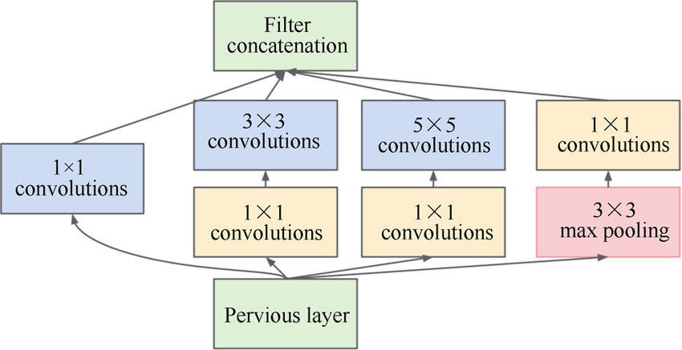
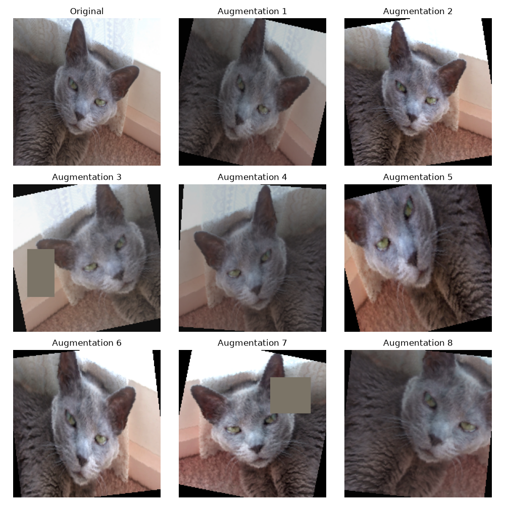
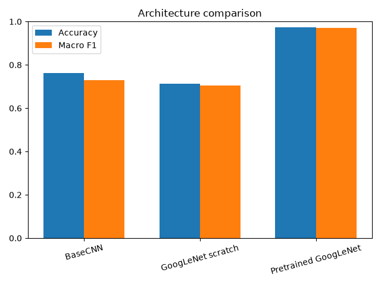
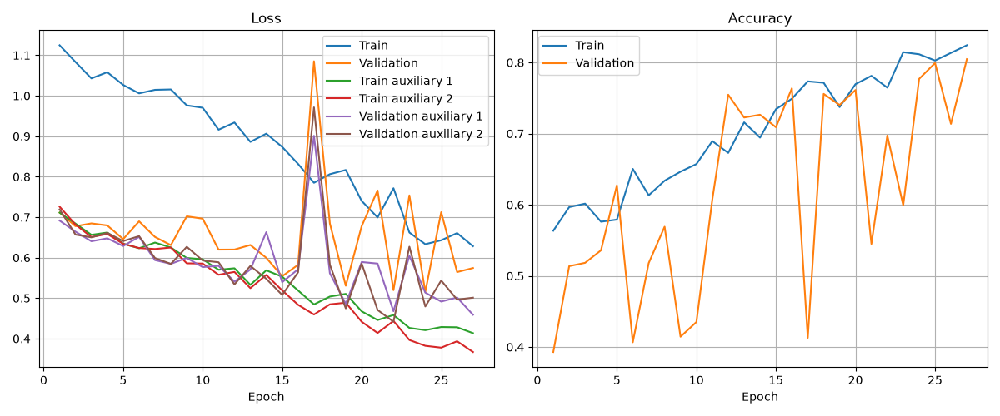
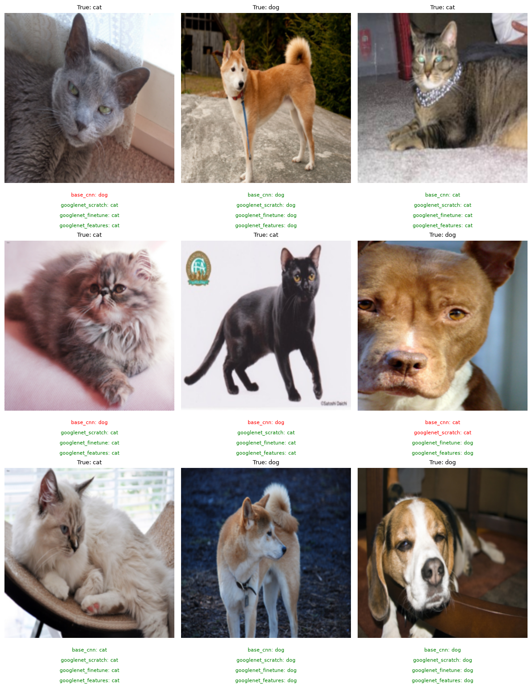

# Project 1: CNNs and Transfer Learning

The goal of this lab is to compare image-classification models built from scratch with transfer learning using a pretrained model. You will implement a conventional CNN, GoogLeNet, data augmentation, training with early stopping, and two ways of reusing an ImageNet model.

The task is binary **cat-versus-dog classification** using the [Oxford-IIIT Pet dataset](https://www.robots.ox.ac.uk/~vgg/data/pets/). Its photographs have useful real-world variation and substantially better resolution than CIFAR, while the binary target keeps the problem "easy". To keep training runs short, the default loaders randomly select 1k training, 500 validation, and 500 test images. If the training takes too long, you can reduce the number of images per set in `config.py`.

> **_NOTE:_**  The dataset has only two classes, so we could just use one output for our models, interpreting it as the probability of, for example, "dog" (low "dog" probability would be "cat"). However, we will use two outputs (probability for "cat" and probability for "dog"), just to make it easier for the future if we want to include more classes.

The random subsets preserve the original class imbalance. Training and validation are non-overlapping subsets of the official `trainval` split, and the seed makes every model use the same samples. For the neural models, the weight of class $c$ is calculated only from the selected training labels:

$$w_c = \frac{N}{C n_c}$$

Here, $N$ is the number of training samples, $C$ is the number of classes, and $n_c$ is the number of training samples from class $c$. The same weights are used in the training and validation cross-entropy losses. The test subset keeps its natural distribution, and the final comparison reports both accuracy and macro F1.

The experiment answers **two different questions**:

1. How do BaseCNN, GoogLeNet trained from scratch, and pretrained GoogLeNet compare?

2. For pretrained GoogLeNet, how does fine-tuning compare with fixed features?

This produces **four experiments** using **three neural architectures**:

- Training the baseline CNN from scratch.

- Training GoogLeNet from scratch.

- Fine-tuning pretrained GoogLeNet.

- Training a Random Forest using features extracted by pretrained GoogLeNet.

The default dependency resolution may install CUDA-enabled PyTorch packages. To use CPU-only wheels, uncomment the `[tool.uv.sources]` and `[[tool.uv.index]]` sections at the end of `pyproject.toml`, and then run `uv sync`.

## Evaluation

This project will be graded in the following way:

- $9$ points will be graded by **automatic tests**, that can be verified by the criteria of a professor if it is necessary, for example, if the test is fulfilled but the goal of the function/class to be completed is not reached.

- $0.5$ points will come from **code style and organization**. This will be checked with **Pylint**, which gives you a mark for your code between $0$ and $10$. If your mark is between $8.5$ and $9.5$, you obtain $0.25$ points, and if it's greater than $9.5$, you obtain $0.5$ points.

- The remaining $0.5$ points will come from **tools to ensure code quality**. The project checks formatting with **Black** and **isort**, and analyzes the code with **Mypy**, **Flake8**, **Ruff**, **Complexipy** and **Bandit**. Passing Black, isort and Complexipy gives $0.25$ points; passing Mypy, Flake8, Ruff and Bandit gives the remaining $0.25$ points.

- You will have a **partial view of the tests**, but in the end professors will run all tests created. Therefore, do not just try to pass the tests, but do a good code and make sure everything is correct.


## Repository structure

```text
project_1/
├── src/                       # Project source code
│   ├── data/
│   │   ├── dataset.py
│   │   └── data_augmentation.py
│   ├── evaluation/
│   │   └── compare.py
│   ├── models/
│   │   ├── base.py
│   │   ├── baseline_cnn.py
│   │   ├── googlenet_from_scratch.py
│   │   └── googlenet.py
│   ├── techniques/
│   │   ├── base_technique.py
│   │   ├── freeze_last_layer.py
│   │   └── use_features.py
│   ├── train/
│   │   ├── early_stopping.py
│   │   ├── loss.py
│   │   └── train.py
│   ├── config.py
│   ├── main.py
│   └── utils.py
├── tests/                     # Fast tests; no dataset or weight download
├── data/                      # Downloaded dataset (ignored by Git)
├── images/
│   ├── readme/                # Figures included in this README
│   └── results/               # CSV reports and experiment figures
└── weights/                   # Best early-stopping checkpoints
```

## Exercises

### Exercise 1: Data Augmentation (1 point)

In this exercise you have to implement data augmentation techniques in `src/data/data_augmentation.py`.

- `build_train_transform`: 0.75 points

- `build_eval_transform`: 0.25 points

### Exercise 2: Model Architectures (3.5 points)

In this exercise you have to implement the shared classifier and the architectures trained from scratch. The model scripts are inside the `src/models` folder; `googlenet.py` provides the pretrained architecture used for transfer learning.

- `base.py`:
  - `_get_classifier`: 0.25 points
  - `forward`: 0.25 points

- `baseline_cnn.py`:
  - `__init__`: 0.25 points
  - `_get_cnn`: 0.25 points
  ```mermaid
  flowchart LR
      input["RGB image"] --> conv1["Conv 3x3<br/>3 to 32 channels"]
      conv1 --> relu1["ReLU"] --> pool1["MaxPool 2x2"]
      pool1 --> conv2["Conv 3x3<br/>32 to 64 channels"]
      conv2 --> relu2["ReLU"] --> pool2["MaxPool 2x2"]
      pool2 --> conv3["Conv 3x3<br/>64 to 128 channels"]
      conv3 --> relu3["ReLU"] --> pool3["MaxPool 2x2"]
      pool3 --> output["128 feature maps"]
  ```

- `googlenet_from_scratch.py`:
  - `InceptionBlock`:
    - `__init__`: 0.25 points
    - `_get_branch_1`: 0.25 points
    - `_get_branch_2`: 0.25 points
    - `_get_branch_3`: 0.25 points
    - `_get_branch_4`: 0.25 points
    - `forward`: 0.25 points
    <p align="center">
      
    </p>
  - `GoogLeNetFromScratch`:
    - `__init__`: 0.25 points
    - `_get_cnn_blocks`: 0.25 points
    - `forward_with_auxiliary`: 0.5 points
    ```mermaid
    flowchart LR
        input["RGB image"] --> stem["ConvBlock 7x7, stride 2<br/>3 to 32 channels"]
        stem --> pool1["MaxPool 3x3, stride 2"]
        pool1 --> conv1["ConvBlock 1x1<br/>32 to 32 channels"]
        conv1 --> conv2["ConvBlock 3x3<br/>32 to 64 channels"]
        conv2 --> pool2["MaxPool 3x3, stride 2"]
        pool2 --> inception1["Inception 1<br/>64 to 64 channels"]
        inception1 --> inception2["Inception 2<br/>64 to 96 channels"]
        inception2 --> pool3["MaxPool 3x3, stride 2"]
        pool3 --> inception3["Inception 3<br/>96 to 128 channels"]
        inception3 --> inception4["Inception 4<br/>128 to 160 channels"]
        inception2 -.-> auxiliary1["Auxiliary classifier 1<br/>4x4 pool, Linear 128, ReLU, logits"]
        inception3 -.-> auxiliary2["Auxiliary classifier 2<br/>4x4 pool, Linear 128, ReLU, logits"]
        inception4 --> avgpool["Adaptive average pool 1x1"]
        avgpool --> classifier["Main classifier<br/>160 features to class logits"]
    ```

    The CNN is divided at the points where the auxiliary classifiers are attached:

    | CNN block | Layers |
    | --- | --- |
    | 1 | Stem, first two pooling layers, Inception 1 and Inception 2 |
    | 2 | Third pooling layer and Inception 3 |
    | 3 | Inception 4 |

    Use the following configurations for the four Inception blocks:

    | Block | Input | 1×1 | 3×3 reduce | 3×3 | 5×5 reduce | 5×5 | Pool projection |
    | --- | ---: | ---: | ---: | ---: | ---: | ---: | ---: |
    | Inception 1 | 64 | 16 | 16 | 24 | 8 | 8 | 16 |
    | Inception 2 | 64 | 24 | 24 | 40 | 8 | 8 | 24 |
    | Inception 3 | 96 | 32 | 24 | 48 | 8 | 16 | 32 |
    | Inception 4 | 128 | 40 | 32 | 64 | 8 | 16 | 40 |

    BaseCNN and GoogLeNet from scratch are intentionally designed to have approximately the same total number of parameters, making their comparison fairer. The auxiliary hidden dimension is set to 128 to achieve this balance. With two output classes, their parameter counts are:

    | Model | Parameters |
    | --- | ---: |
    | BaseCNN | 618,306 |
    | GoogLeNet from scratch | 610,598 |

    The GoogLeNet count includes both auxiliary classifiers, which are used during training.

- `googlenet.py` loads a pretrained GoogLeNet and uses its convolution and Inception blocks as a feature extractor:
  ```mermaid
  flowchart LR
      input["RGB image"] --> conv1["conv1"]
      conv1 --> maxpool1["maxpool1"]
      maxpool1 --> conv2["conv2"]
      conv2 --> conv3["conv3"]
      conv3 --> maxpool2["maxpool2"]
      maxpool2 --> inception3["inception3a and 3b"]
      inception3 --> maxpool3["maxpool3"]
      maxpool3 --> inception4["inception4a to 4e"]
      inception4 --> maxpool4["maxpool4"]
      maxpool4 --> inception5["inception5a and 5b"]
      inception5 --> output["1024 feature maps"]
  ```


### Exercise 3: Train (3 points)

In this exercise you will implement the training of the deep learning models. Calculate the class weights with `get_class_weights(train_loader)`, create a `GoogLeNetLoss` with them, and pass that criterion to `Trainer`. The trainer receives its criterion in the constructor and uses the same weighted loss for training and validation. The training history includes the main training and validation losses, their accuracies, and the training and validation losses of the auxiliary classifiers when they exist. These values are saved in the training-evolution figure. The main validation loss excludes the auxiliary losses; auxiliary validation losses are recorded only for monitoring.

- `loss.py`:
  - `GoogLeNetLoss`: 0.5 points

- `train.py`:
  - `_train_one_epoch`: 1.25 points
  - `_valid_one_epoch`: 0.75 points
  - `fit`: 0.5 points


### Exercise 4: Transfer Learning (1.5 points)

- `freeze_last_layer.py`:
  - `prepare_model`: 0.5 points
  - `fit`: 0.25 points

- `use_features.py`:
  - `extract_dataset_features`: 0.5 points
  - `fit`: 0.25 points

### Code Quality (1 point)

To format the code, run all static checks, execute the tests, or run everything together, use:

    make format
    make lint
    make test
    make check

## Tips

After you complete all the exercises, you can run all the experiments with `uv run python -m src.main` and check that you obtain some figures like these:

<p align="center">
  
</p>

<p align="center">
  
</p>

<p align="center">
  
</p>

<p align="center">
  
</p>
